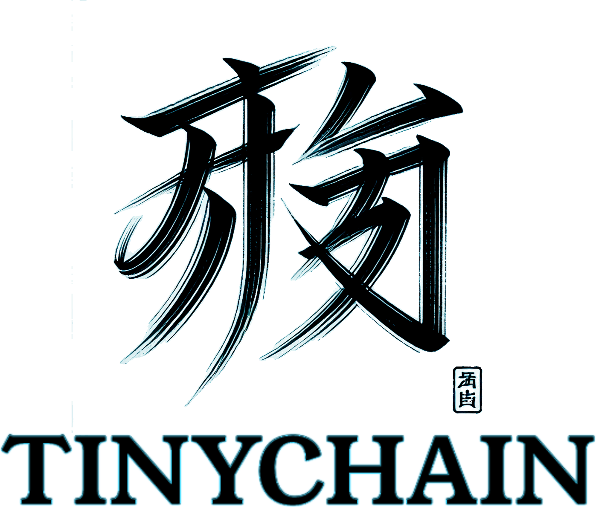

[](https://github.com/tinychainorg/tinychain/actions/workflows/go.yml)

A full blockchain in Go;

 * Nakamoto consensus.
   * Hashcash.
   * Dynamic difficulty retargeting (epochs).
   * Proof-of-work consensus - longest/heaviest chain rule.
   * Merklized transaction tree for light client availability.
 * State sync - interactive binary search for common ancestor, parallelised block header download from multiple peers.
 * Ethereum-like coin state machine - basic ERC20 transfers.
 * ECDSA (curve P256) wallets for signing transactions. Signature malleability fixes.
 * Core data structures: RawBlock, RawTx, Block, Tx, Epoch, BlockDAG, current tip, Miner, NetPeer, Node
 * Networking: HTTP peer interface, messages/methods include [bootstrap/gossip peers, gossip blocks, gossip txs].
 * Miner: mine new blocks on the tip, measure hashrate.
 * CLI: start a node, connect to the network, mine blocks.

Simplifications of the design:

 * The difficulty target is represented as `[32]bytes`; it is uncompressed. There is no `nBits` or custom mantissa.
 * Transaction signatures are in their uncompressed ECDSA form. They are `[65]bytes`, which includes the ECDSA signature type of `0x4`.
 * Transactions specify `from` and `to` in terms of raw ECDSA public keys. There is no ECDSA signature recovery to guess the pubkey from a signature.
 * The state machine is an account-based model, not a UXTO model. It implements just a transfer for coins.

Dependencies:

 * [go-sqlite3](https://github.com/mattn/go-sqlite3?tab=readme-ov-file)

Couple philosophies of this project:

 - distilling a blockchain network down to its core primitives at all layers of the stack.
 - building the equivalent of sqlite for blockchains. Reliable, portable primitives.


## Progress.

WIP.

## Install.

Make sure you have Go 1.2.3+ installed.

```sh
make && cd build/ && ./tinychain node --port 8121 --db testnet.db
```

