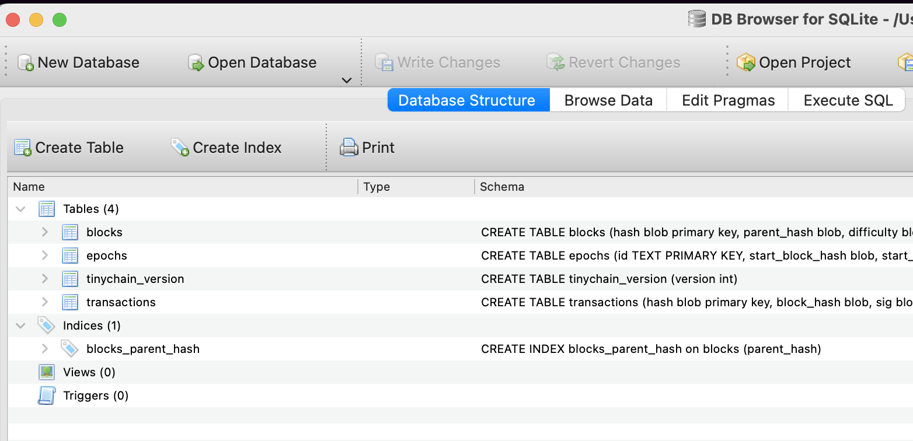

# tinychain

A full blockchain in Go;

 * Nakamoto consensus.
   * Hashcash.
   * Dynamic difficulty retargeting (epochs).
   * Proof-of-work consensus - longest/heaviest chain rule.
   * Merklized transaction tree for light client availability.
 * Ethereum-like coin state machine - basic ERC20 transfers.
 * ECDSA (curve P256) wallets for signing transactions. Signature malleability fixes.
 * Core data structures: RawBlock, RawTx, Block, Tx, Epoch, BlockDAG, current tip, Miner, NetPeer, Node
 * Networking: HTTP peer interface, messages/methods include [bootstrap/gossip peers, gossip blocks, gossip txs].
 * Miner: mine new blocks on the tip, measure hashrate.
 * CLI: start a node, connect to the network, mine blocks.

Simplifications of the design:

 * The difficulty target is represented as `[32]bytes`; it is uncompressed. There is no `nBits` or custom mantissa.
 * Transaction signatures are in their uncompressed ECDSA form. They are `[65]bytes`, which includes the ECDSA signature type of `0x4`.
 * Transactions specify `from` and `to` in terms of raw ECDSA public keys. There is no ECDSA signature recovery to guess the pubkey from a signature.
 * The state machine is an account-based model, not a UXTO model. It implements just a transfer for coins.



## Install.

Make sure you have Go 1.2.3+ installed.

```sh
make && cd build/ && ./tinychain node --port 8121 --db testnet.db
```

## To Do.

Work breakdown:

- [x] building a simple block
- [x] hashing a simple block
- [x] building a proof of work solution
- [x] building a chain of blocks
- [x] computing the epoch/difficulty window for a chain of blocks
- [x] creating a merkle tree accumulation of transactions
- [x] computing the cumulative work in a chain of blocks
- [x] constructing a blockdag and then choosing a tip
- [ ] improve txs
    - [ ] replay protection for txs, tx nonce
    - [ ] add version to RawBlock, RawTransaction for future prosperity
- [ ] block sync algorithm between nodes
- [ ] simple coin state machine
    - [ ] coinbase
    - [ ] state snapshots
    - [ ] state diffs
    - [ ] state checkpoints
- [ ] build a simple mempool module
- [ ] adding a simple state machine
    - [ ] ValidateBlock
        - first transaction is the coinbase
        - maintain a uxto set - unspent transaction outputs
        - validate txs - validate signature, transfer the coins
- [ ] adding a method to recompute the state machine and using cached state 
- [x] implementing networking
    - [ ] simple wrapper for sockets - address, port, and hof's to wrap the latency delays dropped packets etc
    - [x] peers connect
    - [x] peers can send messages, peers can register message handlers
    - [x] gossip peers routine
    - [ ] peer discovery from bittorrent trackers
- [x] implement simple peer
    - [x] can send and receive blocks via network
    - [x] gossip block, gossip tx, get blocks, sync tip
- [x] implement peer discovery and bootstrapping
- [ ] implement wallet and cli tool
- [x] implement miner process
- [ ] implement admin api
- [x] finally implement the CLI tool
    - [x] start miner
    - [x] stop miner
    - [ ] check balance
    - [ ] check network online nodes
    - [ ] send coins
    - [ ] receive coins
- [ ] refactoring
    - [ ] add nonce to tx
    - [ ] refactor miner code to be pretty
    - [ ] improve robustness of sql queries- need to verify we use right number of columns and ?'s
    - [ ] improve block/rawblock. missing fields, unset fields etc. tests for this.
    - [ ] double check big endian canonical encoding
    - [ ] add zlib compression for rawblock, block (just like google's sstable)
- [ ] generate zk proofs of chain history